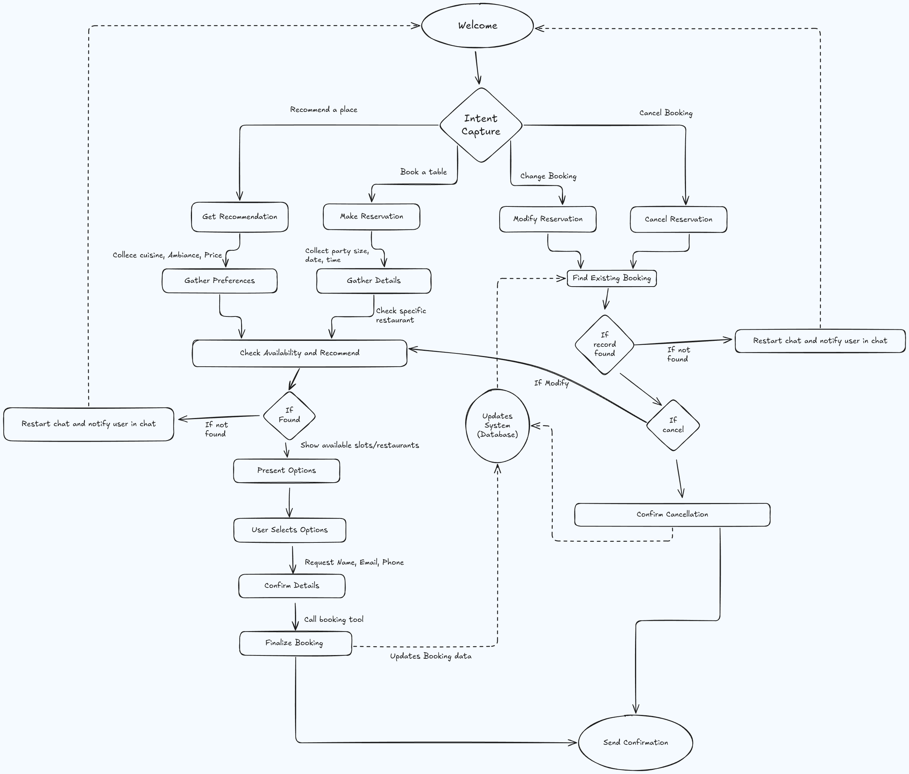

# 🤖 GoodFoods AI Reservation Assistant

This project is a conversational AI agent for the "GoodFoods" restaurant chain. It is designed to handle 24/7 reservation management, provide personalized recommendations, and integrate deeply with the restaurant's operational systems.

The agent is built using a framework-free, decoupled architecture to demonstrate foundational AI engineering skills and provide a strategically advantageous in-house solution.

## 🚀 Demo Video

[Link to Demo Video Coming Soon]

## 🛠️ Setup Instructions

To run the agent locally, follow these steps:

1.  **Clone the repository:**
    ```bash
    git clone https://[your-repo-url].git
    cd SarvamAI-Assignment
    ```

2.  **Create and activate a virtual environment:**
    ```bash
    python3.11 -m venv venv
    source venv/bin/activate
    ```

3.  **Install the required dependencies:**
    ```bash
    pip install -r requirements.txt
    ```

4.  **Run the Streamlit application:**
    ```bash
    streamlit run app.py
    ```

## 🏗️ Technical Architecture & Design

This section details the technical implementation, prompt engineering approach, and core features of the agent.

### System Architecture & Design

A decoupled, three-tier architecture is used to ensure scalability, maintainability, and a clear separation of concerns.

* **Frontend (UI Layer):** A Streamlit application (`app.py`) serves as the user interface. It renders the conversational history and captures user input.
* **Backend (Agent Core):** A Python service (`agent.py`) houses the main agentic logic. It manages the conversational state, orchestrates interactions with the LLM and tools, and returns the final response.
* **Tooling & Data Layer:** Consists of Python functions (`tools.py`) that interact with external systems and static data stores (`restaurantData.csv`).



### Documentation of Prompt Engineering Approach

The agent uses a framework-free approach based on the **Model-Controller-Program (MCP)** architecture to manage the agentic loop. (not **Model Context Protocol** 😅)

1.  **Model (LLM):** The LLM (`llm_client.py`, `system_prompt.py`) acts as the "Planner." It receives the conversation history and a detailed system prompt. Its job is to be conversational and to generate a JSON "plan" of tools to execute. It does *not* call tools directly.
2.  **Controller (Validator):** A deterministic Python class (`validators.py`) intercepts the LLM's plan. It validates all arguments against strict business logic (e.g., date formats, booking windows, time rules) *before* any tool is executed. This prevents invalid API calls and ensures system integrity.
3.  **Program (Tools):** A library of Python functions (`tools.py`) that perform real-world actions, such as querying the database (`data_manager.py`), booking a table, or fetching restaurant details.

This decoupled design makes the system highly maintainable, testable, and secure, as the stochastic LLM is sandboxed from the deterministic business logic and data layers.

### Bot Features

Features are prioritized by implementation difficulty and business value (Green: Core, Yellow: High Value, Red: Advanced).

* 🟢 **24/7 Reservation Management:** Core functionality allowing users to book, modify, and cancel reservations at any time.
* 🟢 **Personalized Recommendations:** Suggests restaurants based on user preferences (cuisine, price, location, ambiance).
* 🟢 **Multi-location Support:** Architected to handle a database of 200 restaurant locations.
* 🟡 **Waitlist Management:** Offers to add users to a digital waitlist for unavailable times.
* 🟡 **Automated Reminders:** Sends SMS/email reminders 24 hours before the reservation to reduce no-shows.
* 🟡 **Group Booking & Special Requests:** Handles large party inquiries and captures special requests (e.g., accessibility, allergy notes).
* 🔴 **Event & Promotion Upselling:** Proactively mentions special events, tasting menus, or promotions.

### KBs / Tools

The bot's functionality is entirely dependent on its ability to call external tools. The core tools required are:

* `check_availability`: Queries the reservation database for open tables.
* `make_reservation`: Creates a new booking in the system.
* `get_restaurant_details`: Retrieves information about specific locations (e.g., address, cuisine, hours).
* `modify_reservation`: Updates an existing booking.
* `cancel_reservation`: Deletes a booking from the system.

## 📈 Business Strategy Summary

This section outlines the success criteria, ROI model, and competitive advantages of the GoodFoods AI Agent.

### Success Criteria

Success will be evaluated through a combination of quantitative performance metrics and qualitative assessments of user experience and strategic business value.

* **Quantitative Metrics:** These are directly measurable indicators that track the agent's performance and its impact on key business operations. They are essential for calculating the return on investment (ROI).
    * Reservation Success Rate
    * Containment Rate
    * Reduction in No-Show Rate
    * Increase in Table Turnover Rate
    * Average Handle Time (AHT)
    * Customer Satisfaction (CSAT) Score
* **Qualitative Metrics:** These metrics capture the less tangible but equally important aspects of the agent's value.
    * Improved User Experience (UX)
    * Enhanced Brand Perception
    * Richness of Captured Preference Data

### Key Performance Indicators (KPIs)

The following table provides a detailed breakdown of the Key Performance Indicators (KPIs) that will be used to measure the success of the project.

### **Table 1: Key Performance Indicators (KPIs) for Success Measurement**

| KPI Category | Metric Name | Formula / Description | Target |
| :--- | :--- | :--- | :--- |
| **Operational Efficiency** | Reservation Success Rate | (Successful Bookings / Total Reservation Conversations) x 100 | >90% |
| | Containment Rate | (Inquiries Handled by AI / Total Inquiries) x 100 | >95% |
| | Staff Time Saved | (Avg. Time per Manual Reservation x # of AI Reservations) - (Time for Human Escalations) | >250 staff-hours/month |
| **Revenue Impact** | Table Turnover Rate | (Parties Seated / Number of Tables) during a specific period | 10% Increase (Peak Hours) |
| | No-Show Rate Reduction | ((Old No-Show % - New No-Show %) / Old No-Show %) x 100 | 20% Reduction |
| | Upsell/Cross-sell Conversion | (# of Special Offers Accepted / # of Offers Presented) x 100 | 5% Conversion |
| **Customer Experience** | Customer Satisfaction (CSAT) | Average score from post-chat survey (1-5 scale) | >4.5 / 5 |
| | Average Handle Time (AHT) | Average duration from conversation start to booking confirmation | < 120 seconds |

### Success Metrics & ROI Modeling

A robust ROI model is essential. The standard ROI formula, $ROI \% = ( \frac{\text{Gain from Investment} - \text{Cost of Investment}}{\text{Cost of Investment}} ) \times 100$, will serve as the quantitative foundation.

**Tangible Gains (Gain from Investment):**

* **Labor Cost Savings:** By automating reservation-related calls, the agent frees up front-of-house staff.
    * *Calculation:* Assume 100 locations save 2 hours/day of staff time. At an average loaded wage of $20/hour, this translates to: $2 \text{ hours/day} \times 100 \text{ locations} \times \$20/\text{hour} \times 30 \text{ days} = \$120,000 \text{ per month in savings}$.
* **Increased Revenue from Reduced No-Shows:** Automated reminders are proven to reduce no-show rates.
* **Increased Revenue from Optimized Table Turnover:** AI-driven table and waitlist management can increase seating efficiency.
* **Direct Revenue from Upselling:** Proactively offering high-margin items or promotions.

**Intangible Gains (Strategic Value):**

* **Value of Proprietary Data Ownership:** Unlike third-party platforms (OpenTable, Resy), this in-house solution ensures GoodFoods retains 100% ownership of its customer data, a priceless asset for building direct relationships.
* **Enhanced Customer Loyalty:** A seamless, personalized, 24/7 booking experience drives repeat business.
* **Brand Differentiation and Innovation:** Positions GoodFoods as a forward-thinking leader.

**Costs of Investment:**

* **One-Time Costs:** Initial development, design, prompt engineering, and project management.
* **Ongoing Costs:** Monthly recurring costs for cloud infrastructure, LLM API usage, and third-party service fees (e.g., SMS gateway).
* **Maintenance & Support:** Costs for monitoring, updates, and technical support.

**Projected ROI:**
Based on conservative estimates, the project is projected to achieve a **positive ROI within 12 to 18 months**.

### Competitive Landscape & Unique Advantages

The solution is not designed to compete with diner networks like OpenTable but as a superior in-house solution.

**Table 2: Competitive Analysis of Reservation Platforms**

| Feature / Aspect | OpenTable | Resy | Tock | GoodFoods AI Agent |
| :--- | :--- | :--- | :--- | :--- |
| **Primary Business Model** | Diner network & marketing channel [41] | Premium, curated network with AmEx integration [46] | Experience & event ticketing platform [33] | In-house operational efficiency & strategic intelligence tool |
| **Pricing Model** | Monthly subscription + Per-cover fee [39, 48] | Tiered monthly subscription fee [40, 49] | Monthly fee + % commission on prepaid experiences [33, 35] | Internal cost model (Dev + Ops); No per-cover fees |
| **Data Ownership** | Limited access; OpenTable owns guest data [35] | Limited access; data leveraged by Resy/AmEx [34] | Restaurant retains full ownership [43] | **GoodFoods maintains 100% ownership and control** |
| **Key Differentiator** | Massive diner network for visibility [41] | Access to exclusive, affluent diner demographic [41, 46] | Focus on prepaid tickets & dynamic pricing [33] | **Deep conversational personalization & capture of unstructured intent** |
| **Customization** | Limited branding | More customization, but within Resy ecosystem | High customization for events [43] | **Fully customizable conversational flow, branding, & integration** |

**Unique Competitive Advantages:**

1.  **Full Data Sovereignty:** GoodFoods breaks free from the "data feudalism" of third-party platforms. Every customer preference and interaction is a proprietary asset.
2.  **Hyper-Personalization:** The agent understands nuanced, multi-turn human language (e.g., "I need a quiet table for 4, kid-friendly, with outdoor seating"). This is far beyond the rigid, form-based booking of competitors.
3.  **Strategic Agility:** The solution is not beholden to any third-party vendor's roadmap or pricing. It can be rapidly adapted, integrated with any internal system (like a new loyalty program), and expanded.

## 📝 Assumptions, Limitations & Future Enhancements

### Assumptions

* The average number of guests per table is 4 (used for table allocation logic).
* The ROI calculation assumes 100 locations, each saving 2 hours of staff time per day, at an average loaded wage of $20/hour.
* A 20% reduction in no-shows and a 10% increase in table turnover are achievable targets.

### Limitations

* **Language Support:** The initial deployment will only support **English**.
* **Scope:** The agent currently only handles restaurant reservations and does not integrate with other aspects of the business (e.g., online ordering, catering).

### Future Enhancements

* **Multi-language Support:** Add support for other languages based on customer demographics, with Spanish as the next priority.
* **Confirmation Emails:** Implement the feature to send email and SMS with details after confirmation.
* **Waitlist Management:** Implement the (Yellow) feature for automated waitlisting and SMS notifications.
* **Automated Reminders:** Build the (Yellow) feature to send SMS/email reminders to reduce no-shows.
* **Group & Special Requests:** Fully implement the (Yellow) feature to handle large parties and special accommodations.
* **Proactive Upselling:** Integrate the (Red) feature to promote special events and high-margin offers during the conversation.
